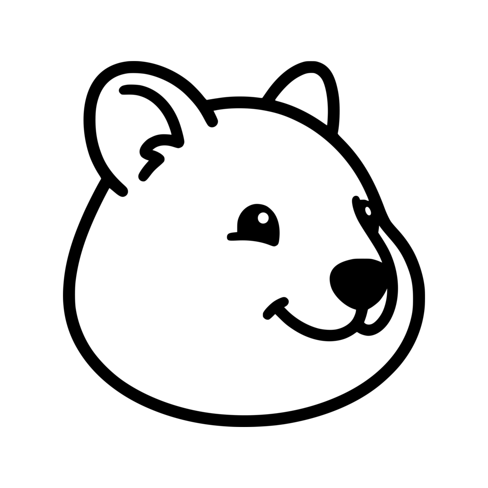
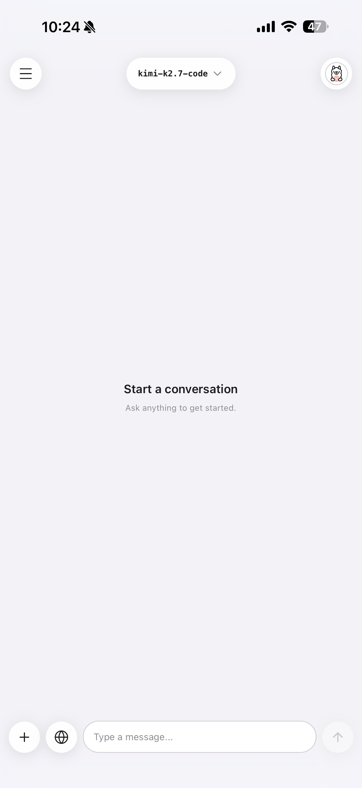
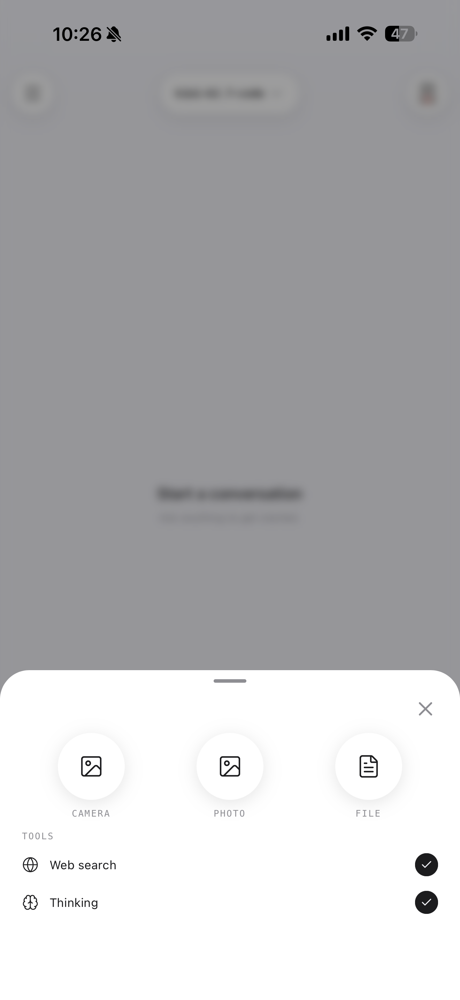
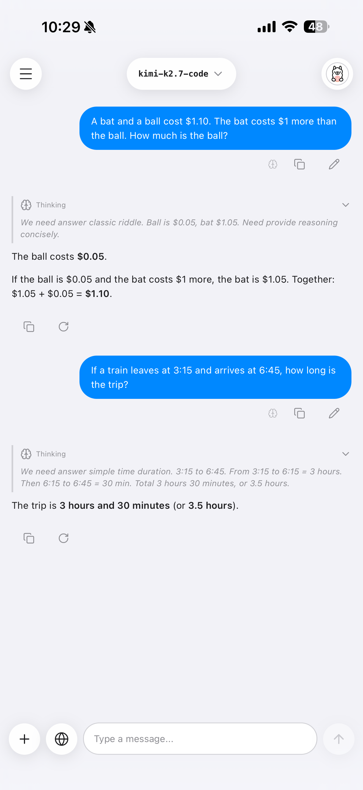

<div align="center">

<picture>
  <source media="(prefers-color-scheme: dark)" srcset="assets/images/icon-dark.png" />
  
</picture>

# Quock

**Ollama Cloud, in your pocket.**

A community-built mobile client for [Ollama Cloud](https://ollama.com). Chat with cloud-hosted LLMs from your phone — privately, with conversations stored locally on-device.

</div>

---

## What is Quock?

**Quock is a mobile app for using [Ollama Cloud](https://ollama.com) on your phone** — a native chat client for iPhone and Android. Sign in once with your `ollama.com` account, pick any cloud-hosted model — Gemma, Qwen, Llama, GPT-OSS, DeepSeek, and more — and start typing. Answers stream back word by word.

It's deliberately small and focused: **open the app, tap a model, type — a streamed reply in under three taps from home.** Your chat history lives in a local database on the device; the only thing that ever leaves your phone is the message you actively send.

## What it does

- 💬 **Chat in your pocket** — sign in once, pick a model, and start typing. Responses stream back word-by-word.
- 🧠 **Thinking & web search** — turn on reasoning for models that support it, or let the model search the web mid-answer. Both are per-chat toggles you set once.
- 🔒 **Conversations stay on your phone** — chat history lives in a local database on your device. The only thing that travels to the cloud is the message you actively send.
- 🖼️ **Add images and screenshots** — drop a photo into the conversation when you're using a vision-capable model.
- 🎨 **Quietly beautiful** — light, dark, and system themes with frosted-glass surfaces, smooth animations, and instant scrolling even on long chats.

## Screenshots

<div align="center">
  
  
  
</div>

## Quick start

```bash
pnpm install

# iOS simulator — installs CocoaPods on first run
pnpm ios

# Android emulator
pnpm android
```

You'll need [Node 22+](https://nodejs.org), [pnpm 11+](https://pnpm.io), [Xcode 16+](https://developer.apple.com/xcode/) or [Android Studio](https://developer.android.com/studio), and an [`ollama.com`](https://ollama.com) account. On first launch, follow the on-device prompt to pair the app with your account. Running on a physical phone? See [`AGENTS.md`](./AGENTS.md#getting-started).

## Contributing

New here? [`CONTRIBUTING.md`](./CONTRIBUTING.md) is the short human path — clone, run, branch, PR. The full rulebook (non-negotiables, feature-first architecture, the `/commit` · `/pr` · `/review` workflow) lives in [`AGENTS.md`](./AGENTS.md).

Bug reports and PRs welcome. Found a security issue? See [`SECURITY.md`](./SECURITY.md).

## Resources

> [!NOTE]
> These are Ollama, Inc.'s official channels. Quock is unaffiliated. For Quock-specific bugs or feature requests, please open an issue on **this** repository.

- [`ollama.com`](https://ollama.com) — homepage, models, cloud subscription
- [`docs.ollama.com`](https://docs.ollama.com/) — official documentation
- [`github.com/ollama/ollama`](https://github.com/ollama/ollama) — runtime source code
- [`discord.com/invite/ollama`](https://discord.com/invite/ollama) — community Discord
- [`twitter.com/ollama`](https://twitter.com/ollama) — announcements on X
- `hello@ollama.com` — Ollama account / billing support

## Acknowledgments

Built on the foundation of [**Ollama**](https://github.com/ollama/ollama) — the open-source local-AI runtime. Thank you to the Ollama team for the support.

If you're new to Ollama, start at [**ollama.com**](https://ollama.com) for the official runtime, models, and cloud subscription. Quock is a mobile lens on top.

## License

[MIT](./LICENSE) © 2026 [Matteo Celani](https://github.com/matteocelani), with the original `Copyright (c) Ollama` preserved per MIT terms.

---

<div align="center">

Made with ❤️ from around the world

</div>
